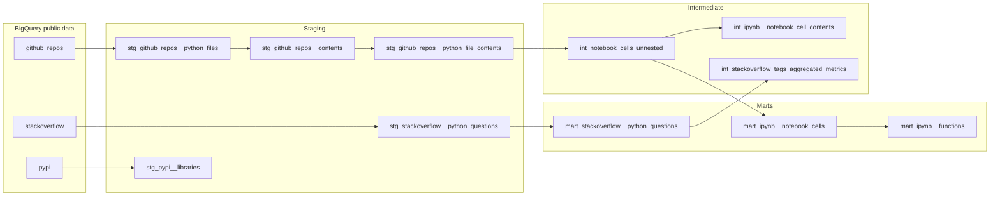

# The Most Python: How Data Scientists Use Python in the Wild

**The Most Python** is a production-style analytics pipeline that analyzes how data scientists use Python in practice, using large-scale public data from **GitHub**, **Stack Overflow**, and **PyPI**.

The project extracts, normalizes, and models real usage patterns of:

- Python libraries
- Functions and APIs
- Notebook code cells
- Common questions and pain points

The goal is to move beyond surveys and tutorials and answer:

> *How do data scientists actually use Python when solving real problems?*

This repository demonstrates applied data engineering and analytics modeling at warehouse scale with **dbt + BigQuery**.

<br>

## Key deliverables

- [Project Brief](https://thedatastrategist.notion.site/The-Most-Used-Python-61218fdc12564fcc8bef195098920808)
- [Looker: "The Most Python" Report](https://datastudio.google.com/reporting/a5096f7e-26c8-48f7-a496-da1fdef6b008)
- [Medium: The Top 10 Python Functions Used by Data Scientists](https://thedatastrategist.medium.com/what-are-pythons-most-used-functions-d760dc28fd96)
- [LinkedIn: The Top 10 Python Functions Used by Data Scientists](https://www.linkedin.com/feed/update/urn:li:activity:6968311247918235648/)

<br>

## Pipeline architecture

Models follow a **staging → intermediate → marts** layout:

| Layer | Purpose | Materialization |
|-------|---------|-----------------|
| **Staging** (`stg_*`) | Clean, filter, and join raw public datasets | Views (tables for heavy GitHub/Stack Overflow/PyPI builds) |
| **Intermediate** (`int_*`) | Reusable parsing and rollups (notebook cells, tag metrics) | Tables |
| **Marts** (`mart_*`) | Analytics-ready datasets for reporting and exploration | Tables |



Raw tables are declared in `models/staging/_sources.yml` and referenced with `{{ source() }}`. Downstream models use `{{ ref() }}` only—no hardcoded project/dataset names.

<br>

## Data sources

### GitHub (`bigquery-public-data.github_repos`)

- Public Python repositories and Jupyter notebooks (`.ipynb`)
- File metadata joined to contents for notebook and script analysis

### Stack Overflow (`bigquery-public-data.stackoverflow`)

- Python-tagged questions with accepted answers and engagement metrics

### PyPI (`bigquery-public-data.pypi`)

- Download counts (sampled to June 2022) joined to package metadata

All data is from **BigQuery public datasets** and transformed in a reproducible, SQL-first workflow.

<br>

## Warehouse models

| Model | Description |
|-------|-------------|
| `stg_github_repos__python_files` | Python `.py` and `.ipynb` paths on `master` |
| `stg_github_repos__contents` | File metadata + non-null contents |
| `stg_github_repos__python_file_contents` | Materialized contents for downstream parsing (**very large**) |
| `stg_stackoverflow__python_questions` | Python-tagged questions with answer text and URLs |
| `stg_pypi__libraries` | PyPI downloads + metadata (June 2022 window) |
| `int_notebook_cells_unnested` | Parsed notebook cells per repo path |
| `int_ipynb__notebook_cell_contents` | Per-notebook import and function reference arrays |
| `int_stackoverflow_tags_aggregated_metrics` | Tag-set aggregates and accepted-answer rates |
| `mart_ipynb__functions` | Function popularity across notebooks |
| `mart_ipynb__libraries` | Library usage across notebooks |
| `mart_stackoverflow__python_questions` | Python SO questions (mart exposure of staging) |
| `mart_stackoverflow__python_tags` | Tag-level engagement metrics |

See `models/marts/_marts__models.yml` for the full mart catalog. Column-level documentation and tests live alongside models in `_models.yml` files.

<br>

## Local development

### Prerequisites

- Docker and `make`
- A GCP project with BigQuery enabled
- A service account JSON key with BigQuery job/data access

### Environment variables

Copy `.env.example` to `.env` and set your values. The Makefile loads `.env` automatically.

| Variable | Description |
|----------|-------------|
| `DBT_BQ_PROJECT` | GCP project id where models are built |
| `DBT_BQ_DATASET` | BigQuery dataset (default: `the_most_python`) |
| `GOOGLE_APPLICATION_CREDENTIALS` | Host path to service account key JSON (mounted into the container) |

### Makefile commands

All dbt commands run through the root `Makefile`, which builds a Docker image once and wraps `docker run` with the project mounted at `/app` (model edits apply without rebuilding) and your GCP key at `/secrets/gcp-key.json`.

One-time setup:

```bash
cp .env.example .env   # then edit DBT_BQ_PROJECT and GOOGLE_APPLICATION_CREDENTIALS
make docker-build
```

Run models:

```bash
# Single model (dbt build --select <model>)
make run-model MODEL=stg_stackoverflow__python_questions

# Every model under a directory (dbt build --select path:<dir>)
make run-dir DIR=staging/stackoverflow
make run-dir DIR=models/marts
```

Run tests:

```bash
# Default selection: core models and singular tests (no GitHub table scans)
make test

# All data tests, including GitHub
make test-all
```

`DIR` can be written as `staging/pypi` or `models/staging/pypi`. Use `DBT_CMD=run` to invoke `dbt run` instead of `dbt build` (tests are skipped).

Run `make help` for the full target list and examples. Profiles live in `profiles/profiles.yml` (`DBT_PROFILES_DIR` is set in the Docker image).

### Cost notes

- `stg_github_repos__python_file_contents` scans multi-TB GitHub content data; materialize intentionally and use `--select` during development.
- `stg_pypi__libraries` limits downloads to **2022-06-01** through **2022-06-30** to keep query size manageable.

Analytical models live under `models/marts/`; during development prefer `make run-dir DIR=models/marts` or `make run-model MODEL=<name>` over building the full DAG.
